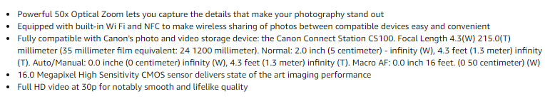
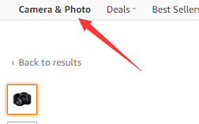

# Seed_Cup_TextCNN

https://github.com/Dedsec-Xu/Seed_Cup_TextCNN

Code for Seed Cup Machine Learning competetion. We developed a CNN NLP model which can process Masked Data of a product description and decide the category of the product.  The final score is 86.04%. 

## Example

By analyzing this:

We get the category of the product

## Category
`data/`: stores dataset

`model/`: stores model

`config.py`: configuration file

`class_idx.py`: to map the output number to product category

`word_idx.py`: use onehot to generate number

`accurancy.py`: F1 class uses save_data to save data from batch and caculate_f1 calculates f1

`Dataloader.py`: load files

`main.py`: include train() and val()

`test.py`: generate test results

`word_preprocess.py`: process dataset and generate npy for data analyze

`word_plot.py`: visualize words

`word_delete.py`: delete a specific word in dataset

`word_delete_high_freq.py`: calculate words over thereshold and save them into npy

`connect_all.py`: to put two datasets together. This give us 0.82 improvement

## Output Score
Output achieved 0.8604 f_point

f1_cate1: 0.9577

f1_cate2: 0.8884

f1_cate3: 0.8302

## Instruction
Use `python main.py` to train

Use `python test.py` to run test

## Enviorment
Ubuntu 18.04

python:3.7.6

cuda:9.0.176

torch 0.4.1

